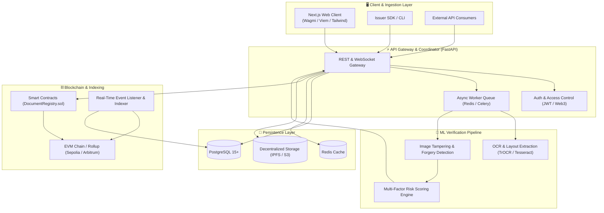

# 🛡️ ProofRoute

<div align="center">

**Decentralized Provenance, AI Document Verification & Autonomous Risk Routing Platform**

[](LICENSE)
[](https://getfoundry.sh/)
[](https://nextjs.org/)
[](https://fastapi.tiangolo.com/)
[](https://pytorch.org/)
[](CONTRIBUTING.md)

[Overview](#-overview) • [Architecture](#-architecture) • [Features](#-key-features) • [Tech Stack](#-tech-stack) • [Quick Start](#-quick-start) • [Workspaces](#-workspaces) • [Agent System](#-agent-system) • [Documentation](#-documentation)

</div>

---

## 📌 Overview

**ProofRoute** is a full-stack platform that combines immutable blockchain attestations, deep learning document verification, real-time blockchain event indexing, and automated risk scoring to eliminate document fraud across financial, supply chain, and legal workflows.

### The Problem
- **Rampant Document Tampering**: Copy-move forgery, digital splicing, and font alterations in critical certificates and invoices.
- **Verification Bottlenecks**: Manual document inspection takes days and is vulnerable to human oversight.
- **Centralized Audit Trails**: Fragile records that can be modified, deleted, or disputed.

### The ProofRoute Solution
- **On-Chain Cryptographic Anchoring**: Store tamper-proof cryptographic hashes and zero-knowledge commitments on EVM-compatible chains.
- **Multimodal AI Verification**: Real-time neural network analysis for copy-move tampering, metadata anomalies, and OCR discrepancy detection.
- **Instant Risk Routing**: Weighted scoring engines categorize submission risk (`LOW`, `MEDIUM`, `HIGH`, `CRITICAL`) and trigger automated workflows or human escalation.
- **Zero-Latency Indexed Queries**: Custom event indexers maintain high-performance relational and cached state for sub-second verification lookups.

---

## 🏗️ Architecture



---

## ✨ Key Features

| Capability | Description |
|---|---|
| **🔒 Immutable Attestations** | Cryptographic hash anchors and issuer signatures deployed via gas-optimized Solidity contracts. |
| **🔍 AI Tamper Detection** | Detects subtle digital manipulations, splicing, font discrepancies, and compression artifacts. |
| **⚡ Sub-Second Verification** | Real-time query engine backed by blockchain event indexers and PostgreSQL indexing. |
| **📊 Explainable Risk Scoring** | Multi-factor risk breakdown (0–100) with visual tamper heatmaps for verifiers. |
| **💼 Issuer Dashboard & Explorer** | Batch upload, digital signing via Web3 wallets, and public verification explorer. |
| **🤖 Autonomous Agent Swarm** | Built-in domain skills and automated workflows for testing, indexing, and smart contract development. |

---

## 🛠️ Tech Stack

| Domain | Technology | Purpose |
|---|---|---|
| **Smart Contracts** | Solidity (`>=0.8.20`), Foundry (`forge`, `cast`, `anvil`) | Core registries, access control, immutable anchoring |
| **Backend API** | Python 3.11+, FastAPI, Pydantic, SQLAlchemy, Alembic | High-throughput REST API, verification router |
| **Frontend** | Next.js 15 (App Router), React 19, TypeScript, Tailwind CSS, shadcn/ui | Verifier portal, issuer dashboard, visual inspection |
| **Web3 & Wallet UX** | Wagmi, Viem, RainbowKit | Wallet connection, transaction signing, contract calls |
| **Machine Learning** | PyTorch, OpenCV, TrOCR / Tesseract, NumPy, Scikit-learn | Tamper detection, OCR extraction, anomaly scoring |
| **Database & Cache** | PostgreSQL 15, Redis 7 | Relational indexing, fast lookup caching, task queues |
| **Testing** | Foundry, Pytest, Playwright, Vitest | Unit, integration, invariant fuzzing, and E2E testing |

---

## 📂 Repository Structure

```
ProofRoute/
├── contracts/                       # Smart contracts & Foundry environment
│   ├── src/                         # Solidity source contracts
│   ├── test/                        # Fuzz & invariant contract tests
│   └── script/                      # Deployment scripts
├── frontend/                        # Next.js web application
│   ├── src/app/                     # Next.js App Router pages
│   ├── src/components/              # UI components & Web3 widgets
│   └── src/lib/                     # API clients, Wagmi configs
├── backend/                         # Core API & business services
│   ├── app/api/                     # REST endpoint routers
│   ├── app/services/                # Core business & verification logic
│   └── app/models/                  # Database schemas & Pydantic models
├── ml/                              # Machine Learning models & pipelines
│   ├── src/pipeline/                # Feature extraction & tampering models
│   └── models/                      # Model weights & preprocessing configs
├── scripts/                         # Database migrations, seeding & node scripts
├── tests/                           # Cross-package E2E & integration test suites
├── docs/                            # Specifications, API contracts, Architecture
│   ├── PRD.md                       # Product Requirements Document
│   ├── ARCHITECTURE.md              # Detailed architecture breakdown
│   ├── API_CONTRACT.md              # REST/WebSocket API specification
│   ├── DATABASE.md                  # Database schema & ERD
│   ├── UI_UX.md                     # Design tokens & UX flow specification
│   ├── DEVELOPMENT_PLAN.md          # Phased roadmap & milestones
│   ├── TESTING_PLAN.md              # Testing strategy & coverage targets
│   ├── SECURITY.md                  # Security policies & threat model
│   ├── DEPLOYMENT.md                # CI/CD & cloud infrastructure guide
│   └── DECISIONS.md                 # Architecture Decision Records (ADRs)
└── .agents/                         # Autonomous multi-agent configuration
    ├── AGENTS.md                    # Agent orchestration guide
    ├── skills/                      # Domain skill manuals for AI agents
    └── workflows/                   # Standard operational procedures
```

---

## 🚀 Quick Start

### 1. Prerequisites
Make sure you have installed:
- [Node.js](https://nodejs.org/) (>= 18.x) & npm/pnpm
- [Python](https://python.org/) (>= 3.10) & pip
- [Foundry](https://book.getfoundry.sh/getting-started/installation) (`forge`, `cast`, `anvil`)
- [Docker](https://www.docker.com/) & Docker Compose (optional, for local DB & Redis)

### 2. Clone & Environment Setup
```bash
# Clone the repository
git clone https://github.com/your-org/proofroute.git
cd ProofRoute

# Copy environment variables template
cp .env.example .env
```

### 3. Initialize Services

#### Smart Contracts
```bash
cd contracts
forge install
forge build
forge test
```

#### Backend API
```bash
cd ../backend
python -m venv .venv
source .venv/bin/activate  # On Windows: .venv\Scripts\activate
pip install -r requirements.txt
uvicorn app.main:app --reload --port 8000
```

#### Frontend Client
```bash
cd ../frontend
npm install
npm run dev
```

---

## 📦 Workspaces

- [contracts/](contracts/) — Smart contracts, deployment scripts, and Foundry invariant tests.
- [backend/](backend/) — FastAPI gateway, task queue workers, and indexing coordinator.
- [frontend/](frontend/) — Next.js portal for verification, batch anchoring, and risk exploration.
- [ml/](ml/) — Multimodal verification pipelines, tamper detection, and risk scoring.
- [scripts/](scripts/) — Migration runners, deployment helpers, and local testnet scripts.
- [tests/](tests/) — End-to-end user journey tests and cross-service integration suites.

---

## 🤖 Agent System

ProofRoute is built with native support for autonomous agent pairing and domain-specific roles.

```
.agents/
├── AGENTS.md                   # Agent guidelines & orchestration rules
├── skills/                     # Domain skills (backend, frontend, blockchain, ml, etc.)
└── workflows/                  # Workflows (feature-development, bug-fix, testing, release)
```

Refer to [AGENTS.md](AGENTS.md) and [.agents/AGENTS.md](.agents/AGENTS.md) for full orchestration guidelines.

---

## 📚 Documentation Index

| Document | Purpose |
|---|---|
| [PRD.md](docs/PRD.md) | Product goals, problem statement, user personas, requirements |
| [ARCHITECTURE.md](docs/ARCHITECTURE.md) | System components, data flows, and technical design |
| [API_CONTRACT.md](docs/API_CONTRACT.md) | REST endpoints, request/response models, and status codes |
| [DATABASE.md](docs/DATABASE.md) | Relational schema, ER diagram, indexing, and migration rules |
| [UI_UX.md](docs/UI_UX.md) | Design system, token hierarchy, and core interactive flows |
| [DEVELOPMENT_PLAN.md](docs/DEVELOPMENT_PLAN.md) | Phased milestones, deliverables, and tracking |
| [TESTING_PLAN.md](docs/TESTING_PLAN.md) | Unit, integration, fuzzing, and E2E testing framework |
| [SECURITY.md](docs/SECURITY.md) | Threat modeling, zero-knowledge handling, and audit guidelines |
| [DEPLOYMENT.md](docs/DEPLOYMENT.md) | Staging/Production environments, CI/CD, and infra setups |
| [DECISIONS.md](docs/DECISIONS.md) | Architecture Decision Records (ADR log) |

---

## 🤝 Contributing

Contributions are welcome! Please read [CONTRIBUTING.md](CONTRIBUTING.md) for our branch strategy, Conventional Commits standard, and pull request checklist.

---

## 📄 License

This project is licensed under the [MIT License](LICENSE).
