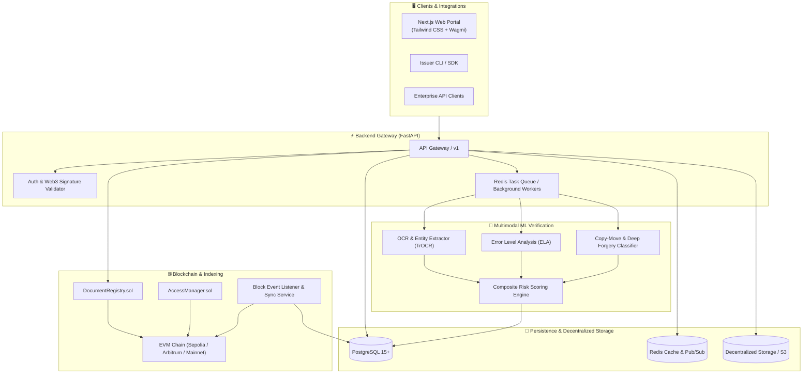

# 🛡️ ProofRoute

<div align="center">

<h3>Decentralized Provenance, AI Document Verification & Autonomous Risk Routing</h3>

<p>
ProofRoute provides cryptographic authenticity proofs and multimodal AI-powered tampering detection to eliminate document fraud across supply chains, legal registries, and financial agreements.
</p>

[](LICENSE)
[](https://getfoundry.sh/)
[](https://nextjs.org/)
[](https://fastapi.tiangolo.com/)
[](https://pytorch.org/)
[](https://www.postgresql.org/)
[](https://redis.io/)

[Key Features](#-key-features) • [System Architecture](#-system-architecture) • [Quick Start](#-quick-start) • [Workspaces](#-workspaces-breakdown) • [API Guide](#-api-quick-reference) • [Agent System](#-autonomous-agent-orchestration) • [Documentation](#-documentation-index)

</div>

---

## 📖 Table of Contents
- [📌 Overview](#-overview)
- [✨ Key Features](#-key-features)
- [🏗️ System Architecture](#-system-architecture)
- [🛠️ Tech Stack](#-tech-stack)
- [📂 Repository Layout](#-repository-layout)
- [🚀 Quick Start & Local Setup](#-quick-start--local-setup)
- [📦 Workspaces Breakdown](#-workspaces-breakdown)
  - [Smart Contracts (`contracts/`)](#1-smart-contracts-contracts)
  - [Backend API (`backend/`)](#2-backend-service-backend)
  - [Frontend Portal (`frontend/`)](#3-frontend-client-frontend)
  - [ML Pipeline (`ml/`)](#4-ml-verification-engine-ml)
  - [Scripts & Automation (`scripts/`)](#5-scripts--automation-scripts)
  - [Test Suites (`tests/`)](#6-test-suites-tests)
- [📡 API Quick Reference](#-api-quick-reference)
- [🤖 Autonomous Agent Orchestration](#-autonomous-agent-orchestration)
- [🔐 Security & Threat Model](#-security--threat-model)
- [📚 Documentation Index](#-documentation-index)
- [🤝 Contributing & Community](#-contributing--community)
- [📄 License](#-license)

---

## 📌 Overview

**ProofRoute** bridges the gap between on-chain cryptographic permanence and real-world document verification. 

### Why ProofRoute?
1. **The Tampering Crisis**: Conventional documents (invoices, certificates, bills of lading, titles) are easily manipulated using digital editing tools with zero trace to the naked eye.
2. **Slow, Manual Audits**: Verifying signatures and physical seals manually creates weeks of delay in high-throughput workflows.
3. **Fragile Centralized Logs**: Databases can be altered, wiped, or disputed when disputes arise.

### How It Works
```
+------------------+       +-------------------+       +---------------------+
| 1. Ingestion     | ----> | 2. AI Inspection  | ----> | 3. On-Chain Check   |
| Client uploads   |       | OCR, ELA & Copy-  |       | Query hash registry |
| doc & hashes it  |       | Move Detection    |       | & issuer signatures |
+------------------+       +-------------------+       +---------------------+
                                                                  |
                                                                  v
+------------------+       +-------------------+       +---------------------+
| 6. Audit Trail   | <---- | 5. Visual Portal  | <---- | 4. Risk Routing     |
| Real-time event  |       | Tamper heatmap &  |       | Score (0-100) routes|
| indexer updates  |       | proof certificate |       | auto-pass / escalate|
+------------------+       +-------------------+       +---------------------+
```

---

## ✨ Key Features

- **🔒 Immutable Blockchain Anchoring**: Document hashes (Keccak-256 / SHA-256) and issuer metadata are recorded irreversibly via gas-optimized Solidity contracts.
- **🧠 Multimodal AI Verification**:
  - **Error Level Analysis (ELA)**: Detects compression anomalies from digital splicing.
  - **Copy-Move Forgery Detection**: Identifies duplicated stamps, signatures, or altered digits.
  - **OCR & Layout Analysis**: Cross-references visual text against structured metadata fields.
- **⚡ Sub-Second Lookups**: Dedicated blockchain event indexers synchronize on-chain states into PostgreSQL and Redis for instant search and verification.
- **📊 Dynamic Risk Routing**: Calculates a composite Risk Score (`0-100`), auto-approving trusted proofs or routing flagged documents for escalation.
- **💼 Web3-Native Issuer Dashboard**: Connect wallets (MetaMask, Coinbase, WalletConnect), batch-anchor documents, and manage role-based issuing authority.
- **🔍 Public Verification Explorer**: Anyone can drag and drop a file to compute its client-side hash and verify authenticity without uploading sensitive contents.

---

## 🏗️ System Architecture



---

## 🛠️ Tech Stack

| Domain | Technology | Version | Purpose |
|---|---|---|---|
| **Smart Contracts** | Solidity | `^0.8.20` | Core registry, role management, access control |
| **Contract Tooling** | Foundry | Latest | Compilation, testing, fuzzing, deployments |
| **Backend API** | Python / FastAPI | `3.11+` | Asynchronous REST API, verification router |
| **ORM & DB** | SQLAlchemy / PostgreSQL | `15+` | Relational data models, indexing, ACID compliance |
| **Caching & Queue** | Redis | `7+` | Token caching, pub/sub, async task queue |
| **Machine Learning** | PyTorch / OpenCV | `2.x` | Deep learning models, image forensics, OCR |
| **Frontend Framework** | Next.js (App Router) | `15.x` | Server components, client portal, explorer |
| **UI & Styling** | Tailwind CSS / shadcn/ui | `3.4+` | Accessible, responsive, modern interface |
| **Web3 Libraries** | Wagmi / Viem | `2.x` | Wallet connections, contract reads/writes |
| **Testing** | Foundry, Pytest, Playwright | - | Unit, integration, invariant, and E2E testing |

---

## 📂 Repository Layout

```
ProofRoute/
├── contracts/                       # Smart contracts (Solidity / Foundry)
│   ├── src/                         # Core contracts (DocumentRegistry, AccessManager)
│   ├── test/                        # Unit, fuzz, and invariant tests
│   └── script/                      # Deployment and upgrade scripts
├── frontend/                        # Web application (Next.js 15 App Router)
│   ├── src/app/                     # Pages, routes, layouts
│   ├── src/components/              # UI components & Web3 widgets
│   └── src/lib/                     # API client, Web3 client configs
├── backend/                         # Backend API (FastAPI / PostgreSQL)
│   ├── app/api/                     # REST API routers (documents, auth, risk)
│   ├── app/services/                # Core business logic & blockchain clients
│   └── app/models/                  # Database models & Pydantic schemas
├── ml/                              # Machine Learning Pipeline
│   ├── src/                         # Forgery detection, OCR, and scoring modules
│   └── models/                      # Model checkpoints & configurations
├── scripts/                         # Operational & DevOps scripts
├── tests/                           # Cross-domain integration & Playwright E2E suites
├── docs/                            # Complete technical documentation suite
└── .agents/                         # Autonomous multi-agent skills & workflows
```

---

## 🚀 Quick Start & Local Setup

### Prerequisites
- **Node.js**: `v18.x` or higher
- **Python**: `3.10` or higher
- **Foundry**: [Install Foundry](https://book.getfoundry.sh/getting-started/installation) (`curl -L https://foundry.paradigm.xyz | bash`)
- **Docker** *(Optional, recommended for PostgreSQL & Redis)*

### Step 1: Clone Repository & Configure Environment
```bash
git clone https://github.com/your-org/proofroute.git
cd ProofRoute

# Create local environment config
cp .env.example .env
```

### Step 2: Start Smart Contract Environment (Foundry)
```bash
cd contracts
forge install
forge build
forge test
```

### Step 3: Run Backend Service
```bash
cd ../backend
python -m venv .venv

# On Linux/macOS:
source .venv/bin/activate
# On Windows:
.venv\Scriptsctivate

pip install -r requirements.txt
uvicorn app.main:app --reload --port 8000
```
API will be live at `http://localhost:8000`. Interactive OpenAPI documentation available at `http://localhost:8000/docs`.

### Step 4: Run Frontend Client
```bash
cd ../frontend
npm install
npm run dev
```
Frontend portal will be live at `http://localhost:3000`.

---

## 📦 Workspaces Breakdown

### 1. Smart Contracts (`contracts/`)
The decentralized foundation for anchoring documents.
- [`DocumentRegistry.sol`](contracts/): Stores document hashes, timestamps, issuer IDs, and revocation states.
- [`AccessManager.sol`](contracts/): Role-based permissions (`ISSUER_ROLE`, `AUDITOR_ROLE`, `ADMIN_ROLE`).
- *See [contracts/README.md](contracts/README.md) for testing commands, gas reports, and deployment scripts.*

### 2. Backend Service (`backend/`)
High-performance asynchronous API for orchestrating verifications.
- Handles document uploads, client-side hash checks, database persistence, and background queue workers.
- *See [backend/README.md](backend/README.md) for route documentation, database migrations, and configurations.*

### 3. Frontend Client (`frontend/`)
User-facing portal for document verification and management.
- Public drag-and-drop hash checker (client-side SHA-256 calculation).
- Web3 wallet dashboard for issuers to batch-sign and anchor document registries.
- *See [frontend/README.md](frontend/README.md) for component architecture and environment setups.*

### 4. ML Verification Engine (`ml/`)
Multimodal AI models for forgery detection.
- Deep image forensics, Error Level Analysis (ELA), and OCR text consistency checking.
- *See [ml/README.md](ml/README.md) for training pipelines, model checkpoints, and inference APIs.*

### 5. Scripts & Automation (`scripts/`)
Utility scripts for local testnet launching, database seeding, and smart contract verification.
- *See [scripts/README.md](scripts/README.md) for script catalogues and usage guides.*

### 6. Test Suites (`tests/`)
Comprehensive end-to-end and cross-workspace integration tests.
- *See [tests/README.md](tests/README.md) for testing pyramid guidelines and CI configurations.*

---

## 📡 API Quick Reference

| Method | Endpoint | Description |
|---|---|---|
| `POST` | `/api/v1/documents/verify` | Verify document authenticity & run ML risk analysis |
| `POST` | `/api/v1/documents/anchor` | Register and anchor new document hash on-chain |
| `GET` | `/api/v1/documents/{hash}` | Retrieve indexed on-chain and verification history |
| `POST` | `/api/v1/ml/risk-score` | Direct inference endpoint for ML tampering analysis |
| `GET` | `/api/v1/health` | Service health status (DB, Redis, RPC, ML) |

*Full API contracts and schemas are defined in [docs/API_CONTRACT.md](docs/API_CONTRACT.md).*

---

## 🤖 Autonomous Agent Orchestration

ProofRoute is architected for seamless multi-agent autonomy. The repository includes domain skills and operational workflows in `.agents/`:

| Domain Skill | Path | Description |
|---|---|---|
| **Blockchain** | [`.agents/skills/blockchain/SKILL.md`](.agents/skills/blockchain/SKILL.md) | Smart contract development, gas optimization, Foundry fuzzing |
| **Backend** | [`.agents/skills/backend/SKILL.md`](.agents/skills/backend/SKILL.md) | FastAPI services, Pydantic validation, business logic |
| **Frontend** | [`.agents/skills/frontend/SKILL.md`](.agents/skills/frontend/SKILL.md) | Next.js App Router, Tailwind, Wagmi/Viem integration |
| **Doc Verification** | [`.agents/skills/document-verification/SKILL.md`](.agents/skills/document-verification/SKILL.md) | OCR extraction, ELA, copy-move detection |
| **Risk Analysis** | [`.agents/skills/risk-analysis/SKILL.md`](.agents/skills/risk-analysis/SKILL.md) | Composite scoring algorithms, fraud heuristics |
| **Indexer** | [`.agents/skills/indexer/SKILL.md`](.agents/skills/indexer/SKILL.md) | Blockchain event listeners and reorg handling |
| **Testing** | [`.agents/skills/testing/SKILL.md`](.agents/skills/testing/SKILL.md) | Unit, integration, invariant, and E2E testing |

Review [AGENTS.md](AGENTS.md) for cross-domain orchestration guidelines.

---

## 🔐 Security & Threat Model

- **Zero PII On-Chain**: No personal or confidential document contents are ever stored on-chain. Only cryptographic hashes and zero-knowledge commitments are anchored.
- **Reentrancy & Access Control**: Contracts utilize OpenZeppelin's battle-tested security primitives.
- **Client-Side Hashing Option**: Users can verify files by computing hashes locally in their browser without uploading the file payload to the backend server.
- **Security Inquiries**: For vulnerabilities, please contact `security@proofroute.io`. See [docs/SECURITY.md](docs/SECURITY.md).

---

## 📚 Documentation Index

| Document | Description |
|---|---|
| [📖 docs/PRD.md](docs/PRD.md) | Product Requirements Document & specifications |
| [🏛️ docs/ARCHITECTURE.md](docs/ARCHITECTURE.md) | Comprehensive system architecture & data flows |
| [📜 docs/API_CONTRACT.md](docs/API_CONTRACT.md) | Complete OpenAPI endpoint schemas and contracts |
| [🗄️ docs/DATABASE.md](docs/DATABASE.md) | PostgreSQL schema, ER diagram, and migration rules |
| [🎨 docs/UI_UX.md](docs/UI_UX.md) | Design tokens, typography, and interactive wireframes |
| [📅 docs/DEVELOPMENT_PLAN.md](docs/DEVELOPMENT_PLAN.md) | Milestone roadmap and execution phases |
| [🧪 docs/TESTING_PLAN.md](docs/TESTING_PLAN.md) | Testing pyramid, invariants, and quality gates |
| [🛡️ docs/SECURITY.md](docs/SECURITY.md) | Threat model, zero-knowledge policies & audit standards |
| [🌐 docs/DEPLOYMENT.md](docs/DEPLOYMENT.md) | CI/CD, cloud infrastructure, and network configs |
| [📝 docs/DECISIONS.md](docs/DECISIONS.md) | Architecture Decision Records (ADRs) |

---

## 🤝 Contributing & Community

We welcome contributions from developers, researchers, and security auditors!
1. Check open issues or review [docs/DEVELOPMENT_PLAN.md](docs/DEVELOPMENT_PLAN.md).
2. Follow our [CONTRIBUTING.md](CONTRIBUTING.md) guide and use Conventional Commits.
3. Submit a Pull Request against the `develop` branch.

---

## 📄 License

This project is licensed under the terms of the **MIT License**. See [LICENSE](LICENSE) for details.
