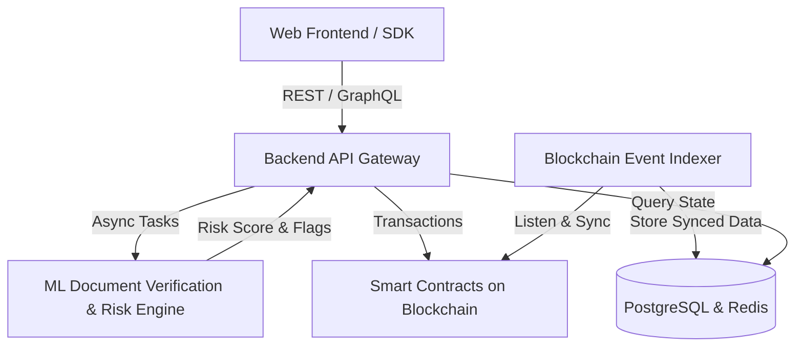

# System Architecture

## 🏛️ High-Level Architecture Overview

## 🧩 Core Components

1. **Smart Contracts (`contracts/`)**:
   - `DocumentRegistry.sol`: Anchors document hashes, issuer signatures, and status.
   - `AccessManager.sol`: Role-based access control for issuers and verifiers.

2. **Backend Service (`backend/`)**:
   - API endpoints for verification, batch submissions, and user management.
   - Job queue for ML inference and blockchain transaction submission.

3. **ML Pipeline (`ml/`)**:
   - Document layout analysis & OCR.
   - Copy-move and metadata tampering detection.
   - Risk scoring engine outputting confidence scores (0-100).

4. **Event Indexer (`backend/indexer/` or `scripts/`)**:
   - High-throughput listener for contract events (`DocumentRegistered`, `DocumentRevoked`).
   - Syncs on-chain data into PostgreSQL for instant relational queries.

5. **Frontend Client (`frontend/`)**:
   - Next.js dashboard with wallet connection (Ethers / Viem / Wagmi).
   - Drag-and-drop document verifier with visual tamper heatmaps.
