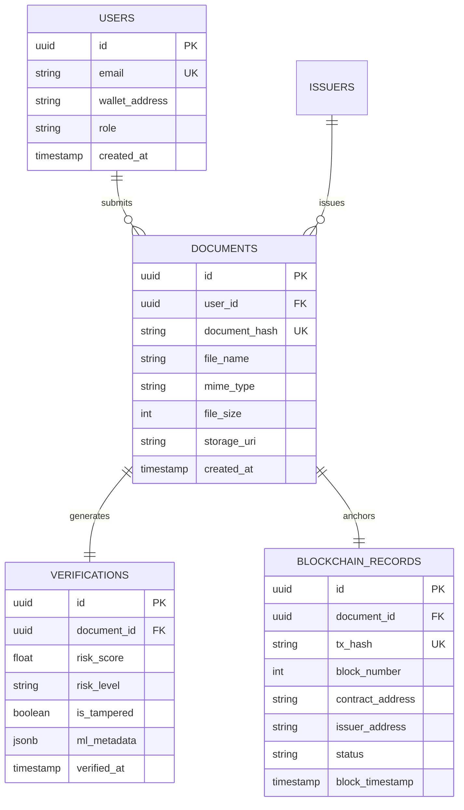

# Database Design & Schema

## 🗄️ Database Engine
- **Primary Relational DB**: PostgreSQL 15+
- **Cache & Message Broker**: Redis 7+

---

## 📊 Entity Relationship Diagram (ERD)

---

## 🔄 Migration Strategy
- Migrations managed via Alembic (Python) / Prisma / Drizzle.
- All schema changes require backward-compatible rollback migrations.
